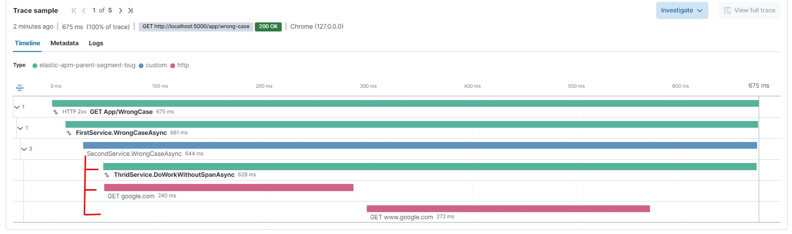
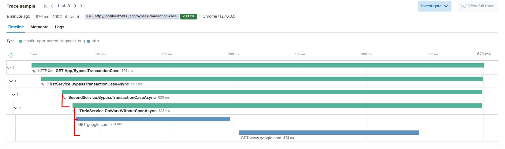
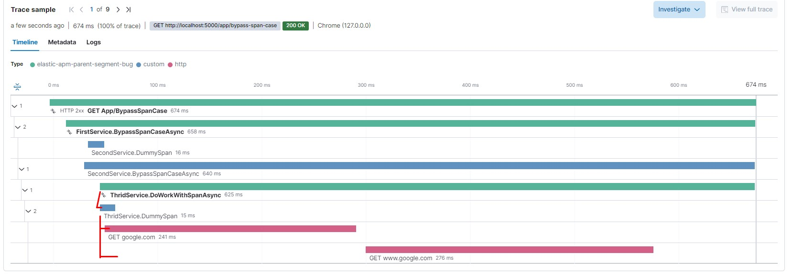

# Elatic APM - Parent Segment Bug

A POC that replicates a bug in Elastic APM where a transaction from HttpClient is appended to a wrong parent

## Getting Started
1. Open `ElasticApm.ParentSegmentBug/appsettings.json`
2. Set value for `ElasticApm:ServerUrls` and `ElasticApm:SecretToken`
3. Start project
4. Open Swagger UI at http://localhost:5000/swagger/index.html

## APM segments structure
*Client -> Endpoint in controller -> First Service -> Second Service -> Third Service -> google.com (using a HTTP client)*

1. A transaction is automatically created by the APM SDK before `Endpoint in controller`
2. A transaction is created manually in `First Service` where the parent is the transaction created in step 1
3. A transaction/span is created manually in `Second Service` where the parent is the transaction created in step 2
4. A transaction/span is created manually in `Third Service` where the parent is the transaction created in step 3
5. A GET request is sent to google.com using a HttpClient

## Bug replication
1. Send a GET request to `wrong-case` endpoint
``` sh
curl -X 'GET' \
  'http://localhost:5000/app/wrong-case' \
  -H 'accept: */*'
```

2. Send a GET request to `bypass-transaction-case` endpoint
``` sh
curl -X 'GET' \
  'http://localhost:5000/app/bypass-transaction-case' \
  -H 'accept: */*'
```

3. Send a GET request to `bypass-span-case` endpoint
``` sh
curl -X 'GET' \
  'http://localhost:5000/app/bypass-span-case' \
  -H 'accept: */*'
```

4. Open Elastic APM portal and go to `elastic-apm-parent-segment-bug` service in 'localhost' environment

5. Observe where the HTTP client transaction created by the APM sdk is appended to:
______
#### wrong-case

______
#### bypass-transaction-case

______
#### bypass-span-case

______

## The problem
1. [OK] Looking at the `bypass-transaction-case` we can see that the transaction created for the request to google.com is appended correctly as a child to `Third Service`'s method, if the `Second Service` creates a transaction before calling `Third Service`

2. [NOK] Looking at the `wrong-case` we can see that the transaction created for the request to google.com is appended wrongly as a child to `Second Service`'s method, instead of `Third Service`'s method, if the `Second Service` creates a span before calling `Third Service`.

3. [OK] Starting from previous point (2), if a create a dummy span in the `Third Service`'s method before using HttpClient to call google.com, the Tracing Context is refresh and we can observe now that the transaction created automatically for google.com is appended to the dummy span from `Third Service`.

## Expectation
The transaction created for google.com in `wrong-case` should be a child of `Third Service`, as it is in `bypass-transaction-case`. 